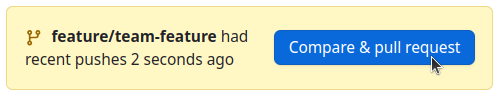
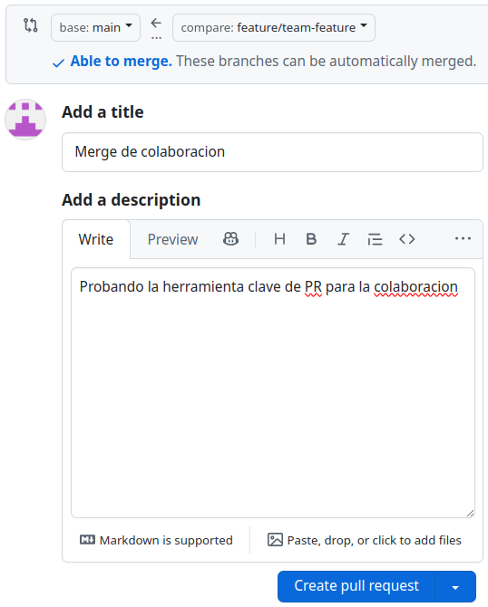
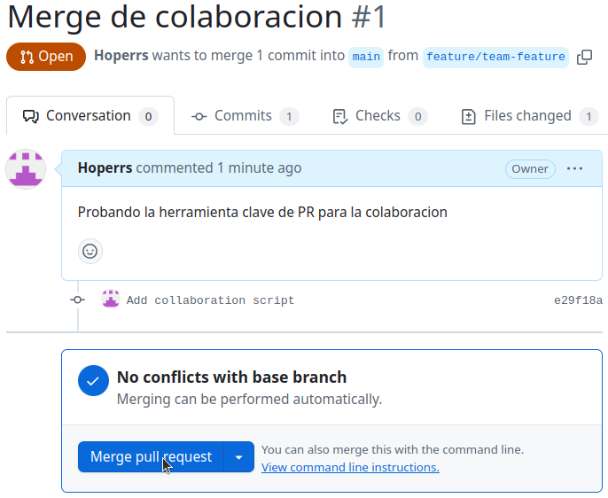
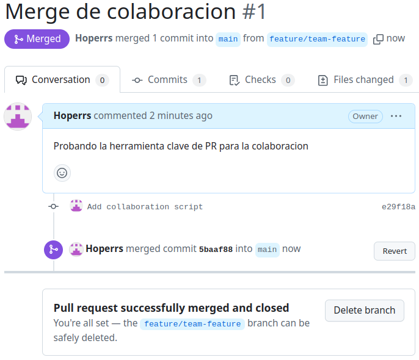

```bash
hoperrs@hoperrs:~/Escritorio/DS/Actividades/Actividad04$ git config --global user.name "hoperrs"
hoperrs@hoperrs:~/Escritorio/DS/Actividades/Actividad04$ git config --global user.email "kchavezc19@gmail.com"
```

```bash
hoperrs@hoperrs:~/Escritorio/DS/Actividades/Actividad04$ git config --list
user.name=hoperrs
user.email=kchavezc19@gmail.com
init.defaultbranch=main
```

```bash
hoperrs@hoperrs:~/Escritorio/DS/Actividades/Actividad04$ mkdir hoperrs-repo
hoperrs@hoperrs:~/Escritorio/DS/Actividades/Actividad04$ ls
Actividad4-CC3S2.md  Actividad4-Solucion.md  hoperrs-repo
hoperrs@hoperrs:~/Escritorio/DS/Actividades/Actividad04$ cd hoperrs-repo/
hoperrs@hoperrs:~/Escritorio/DS/Actividades/Actividad04/hoperrs-repo$ git init
Inicializado repositorio Git vacío en /home/hoperrs/Escritorio/DS/Actividades/Actividad04/hoperrs-repo/.git/
```

```bash
hoperrs@hoperrs:~/Escritorio/DS/Actividades/Actividad04/hoperrs-repo$ echo " README" > README.md
hoperrs@hoperrs:~/Escritorio/DS/Actividades/Actividad04/hoperrs-repo$ ls
README.md
```

```bash
hoperrs@hoperrs:~/Escritorio/DS/Actividades/Actividad04/hoperrs-repo$ git status
En la rama main

No hay commits todavía

Archivos sin seguimiento:
  (usa "git add <archivo>..." para incluirlo a lo que será confirmado)
        README.md

no hay nada agregado al commit pero hay archivos sin seguimiento presentes (usa "git add" para hacerles seguimiento)
```

```bash
hoperrs@hoperrs:~/Escritorio/DS/Actividades/Actividad04/hoperrs-repo$ git add README.md 
hoperrs@hoperrs:~/Escritorio/DS/Actividades/Actividad04/hoperrs-repo$ git status
En la rama main

No hay commits todavía

Cambios a ser confirmados:
  (usa "git rm --cached <archivo>..." para sacar del área de stage)
        nuevos archivos: README.md

```

```bash
hoperrs@hoperrs:~/Escritorio/DS/Actividades/Actividad04/hoperrs-repo$ git commit -m "Initial commit with README.md"
[main (commit-raíz) 323754f] Initial commit with README.md
 1 file changed, 1 insertion(+)
 create mode 100644 README.md
```

```bash
hoperrs@hoperrs:~/Escritorio/DS/Actividades/Actividad04/hoperrs-repo$ git status
En la rama main
nada para hacer commit, el árbol de trabajo está limpio
```

```bash
hoperrs@hoperrs:~/Escritorio/DS/Actividades/Actividad04/hoperrs-repo$ git log
commit 323754f88d5fd42cbc6e21a66b5be6815be115d4 (HEAD -> main)
Author: hoperrs <kchavezc19@gmail.com>
Date:   Sat Apr 12 07:19:20 2025 -0500

    Initial commit with README.md
```

```bash
hoperrs@hoperrs:~/Escritorio/DS/Actividades/Actividad04/hoperrs-repo$ git log --graph --pretty=format:'%x09 %h %ar ("%an") %s'
*        323754f hace 6 minutos ("hoperrs") Initial commit with README.md
```

```bash
hoperrs@hoperrs:~/Escritorio/DS/Actividades/Actividad04/hoperrs-repo$ echo " CONTRIBUTING" > CONTRIBUTING.md
hoperrs@hoperrs:~/Escritorio/DS/Actividades/Actividad04/hoperrs-repo$ echo " README\n\nWelcome to the project" > README.md
hoperrs@hoperrs:~/Escritorio/DS/Actividades/Actividad04/hoperrs-repo$ git add .
hoperrs@hoperrs:~/Escritorio/DS/Actividades/Actividad04/hoperrs-repo$ git commit -m "Set up the repository base documentation"
[main 6fad0ba] Set up the repository base documentation
 2 files changed, 2 insertions(+), 1 deletion(-)
 create mode 100644 CONTRIBUTING.md
```

```bash
hoperrs@hoperrs:~/Escritorio/DS/Actividades/Actividad04/hoperrs-repo$ echo "print('Hello World')" > main.py
hoperrs@hoperrs:~/Escritorio/DS/Actividades/Actividad04/hoperrs-repo$ git add .
hoperrs@hoperrs:~/Escritorio/DS/Actividades/Actividad04/hoperrs-repo$ git commit -m "Add main.py"
[main 4943b41] Add main.py
 1 file changed, 1 insertion(+)
 create mode 100644 main.py
```

```bash
hoperrs@hoperrs:~/Escritorio/DS/Actividades/Actividad04/hoperrs-repo$ git log --oneline
4943b41 (HEAD -> main) Add main.py
6fad0ba Set up the repository base documentation
323754f Initial commit with README.md
```

```bash
hoperrs@hoperrs:~/Escritorio/DS/Actividades/Actividad04/hoperrs-repo$ git branch
* main
```

```bash
hoperrs@hoperrs:~/Escritorio/DS/Actividades/Actividad04/hoperrs-repo$ git branch feature/new-feature
hoperrs@hoperrs:~/Escritorio/DS/Actividades/Actividad04/hoperrs-repo$ git branch
  feature/new-feature
* main
```

```bash
hoperrs@hoperrs:~/Escritorio/DS/Actividades/Actividad04/hoperrs-repo$ git checkout feature/new-feature 
Cambiado a rama 'feature/new-feature'
```

```bash
operrs@hoperrs:~/Escritorio/DS/Actividades/Actividad04/hoperrs-repo$ git checkout -b feature/another-new-feature
Cambiado a nueva rama 'feature/another-new-feature'
hoperrs@hoperrs:~/Escritorio/DS/Actividades/Actividad04/hoperrs-repo$ git switch -c feature/another-new-feature2
Cambiado a nueva rama 'feature/another-new-feature2'
```

```bash
hoperrs@hoperrs:~/Escritorio/DS/Actividades/Actividad04/hoperrs-repo$ git checkout main
Cambiado a rama 'main'
hoperrs@hoperrs:~/Escritorio/DS/Actividades/Actividad04/hoperrs-repo$ git merge feature/new-feature 
Ya está actualizado.
```

```bash
hoperrs@hoperrs:~/Escritorio/DS/Actividades/Actividad04/hoperrs-repo$ git branch -d feature/new-feature 
Eliminada la rama feature/new-feature (era 4943b41).
hoperrs@hoperrs:~/Escritorio/DS/Actividades/Actividad04/hoperrs-repo$ git branch
  feature/another-new-feature
  feature/another-new-feature2
* main
```


Ejercicio 1

```bash
hoperrs@hoperrs:~/Escritorio/DS/Actividades/Actividad04/hoperrs-repo$ git branch
  feature/another-new-feature
  feature/another-new-feature2
* main
hoperrs@hoperrs:~/Escritorio/DS/Actividades/Actividad04/hoperrs-repo$ git checkout -b feature/advanced-feature
Cambiado a nueva rama 'feature/advanced-feature'
```

```bash
hoperrs@hoperrs:~/Escritorio/DS/Actividades/Actividad04/hoperrs-repo$ cat main.py 
print('Hello World')

def greet():
    print('Hello from advanced feature branch')

greet()
```

```bash
hoperrs@hoperrs:~/Escritorio/DS/Actividades/Actividad04/hoperrs-repo$ git add main.py 
hoperrs@hoperrs:~/Escritorio/DS/Actividades/Actividad04/hoperrs-repo$ git commit -m "Add greet function in advanced feature"
[feature/advanced-feature 57055f9] Add greet function in advanced feature
 1 file changed, 5 insertions(+)
```

```bash
hoperrs@hoperrs:~/Escritorio/DS/Actividades/Actividad04/hoperrs-repo$ git checkout main
Cambiado a rama 'main'
```

```python
print('Hello World - updated in main')
```

```bash
hoperrs@hoperrs:~/Escritorio/DS/Actividades/Actividad04/hoperrs-repo$ git add main.py 
hoperrs@hoperrs:~/Escritorio/DS/Actividades/Actividad04/hoperrs-repo$ git commit -m "Updated main.py message in main branch"
[main fb4e021] Updated main.py message in main branch
 1 file changed, 1 insertion(+), 1 deletion(-)
```

```bash
operrs@hoperrs:~/Escritorio/DS/Actividades/Actividad04/hoperrs-repo$ git merge feature/advanced-feature 
Auto-fusionando main.py
CONFLICTO (contenido): Conflicto de fusión en main.py
Fusión automática falló; arregle los conflictos y luego realice un commit con el resultado.
```

```python
<<<<<<< HEAD
print('Hello World - updated in main')
=======
print('Hello World')

def greet():
    print('Hello from advanced feature branch')

greet()
>>>>>>> feature/advanced-feature
```

```python
print('Hello World - updated in main')

def greet():
    print('Hello from advanced feature branch')

greet()
```

```bash
hoperrs@hoperrs:~/Escritorio/DS/Actividades/Actividad04/hoperrs-repo$ git add main.py 
hoperrs@hoperrs:~/Escritorio/DS/Actividades/Actividad04/hoperrs-repo$ git commit -m "Resolve merge conflict between main and feature/advanced-feature"
[main f175f37] Resolve merge conflict between main and feature/advanced-feature
```

```bash
hoperrs@hoperrs:~/Escritorio/DS/Actividades/Actividad04/hoperrs-repo$ git branch -d feature/advanced-feature 
Eliminada la rama feature/advanced-feature (era 57055f9).
```


Ejercicio 2: Exploración y manipulación del historial de commits

```bash
hoperrs@hoperrs:~/Escritorio/DS/Actividades/Actividad04/hoperrs-repo$ git log -p
commit f175f37f0fcfb501477c75da11558500538a2560 (HEAD -> main)
Merge: fb4e021 57055f9
Author: hoperrs <kchavezc19@gmail.com>
Date:   Sat Apr 12 08:59:27 2025 -0500

    Resolve merge conflict between main and feature/advanced-feature

commit fb4e02105bec87ce2ef8f78b970975c18680ca93
Author: hoperrs <kchavezc19@gmail.com>
Date:   Sat Apr 12 08:36:58 2025 -0500

    Updated main.py message in main branch

diff --git a/main.py b/main.py
index df1dc68..971e8f4 100644
--- a/main.py
+++ b/main.py
@@ -1 +1 @@
-print('Hello World')
+print('Hello World - updated in main')

commit 57055f9c9d48348c6c48ef88e798e1143b2b23f9
Author: hoperrs <kchavezc19@gmail.com>
Date:   Sat Apr 12 08:30:22 2025 -0500

    Add greet function in advanced feature

diff --git a/main.py b/main.py
index df1dc68..1b4fc93 100644
--- a/main.py
+++ b/main.py
@@ -1 +1,6 @@
 print('Hello World')
+
+def greet():
+    print('Hello from advanced feature branch')
+
+greet()

commit 4943b41ed6bd7d4963457eb7de18f12b82d10115 (feature/another-new-feature2, feature/another-new-feature)
Author: hoperrs <kchavezc19@gmail.com>
Date:   Sat Apr 12 07:32:15 2025 -0500

    Add main.py

diff --git a/main.py b/main.py
new file mode 100644
index 0000000..df1dc68
--- /dev/null
+++ b/main.py
@@ -0,0 +1 @@
+print('Hello World')

commit 6fad0ba3652e0cc963eb407995374d7e18002d1a
Author: hoperrs <kchavezc19@gmail.com>
Date:   Sat Apr 12 07:28:15 2025 -0500

    Set up the repository base documentation

diff --git a/CONTRIBUTING.md b/CONTRIBUTING.md
new file mode 100644
index 0000000..2e8cc63
--- /dev/null
+++ b/CONTRIBUTING.md
@@ -0,0 +1 @@
+ CONTRIBUTING
diff --git a/README.md b/README.md
index 2772834..69aa3ec 100644
--- a/README.md
+++ b/README.md
@@ -1 +1 @@
- README
+ README\n\nWelcome to the project

commit 323754f88d5fd42cbc6e21a66b5be6815be115d4
Author: hoperrs <kchavezc19@gmail.com>
Date:   Sat Apr 12 07:19:20 2025 -0500

    Initial commit with README.md

diff --git a/README.md b/README.md
new file mode 100644
index 0000000..2772834
--- /dev/null
+++ b/README.md
@@ -0,0 +1 @@
+ README
(END)
```

```bash
hoperrs@hoperrs:~/Escritorio/DS/Actividades/Actividad04/hoperrs-repo$ git log --author="hoperrs"
commit f175f37f0fcfb501477c75da11558500538a2560 (HEAD -> main)
Merge: fb4e021 57055f9
Author: hoperrs <kchavezc19@gmail.com>
Date:   Sat Apr 12 08:59:27 2025 -0500

    Resolve merge conflict between main and feature/advanced-feature

commit fb4e02105bec87ce2ef8f78b970975c18680ca93
Author: hoperrs <kchavezc19@gmail.com>
Date:   Sat Apr 12 08:36:58 2025 -0500

    Updated main.py message in main branch

commit 57055f9c9d48348c6c48ef88e798e1143b2b23f9
Author: hoperrs <kchavezc19@gmail.com>
Date:   Sat Apr 12 08:30:22 2025 -0500

    Add greet function in advanced feature

commit 4943b41ed6bd7d4963457eb7de18f12b82d10115 (feature/another-new-feature2, feature/another-new-feature)
Author: hoperrs <kchavezc19@gmail.com>
Date:   Sat Apr 12 07:32:15 2025 -0500

    Add main.py

commit 6fad0ba3652e0cc963eb407995374d7e18002d1a
Author: hoperrs <kchavezc19@gmail.com>
Date:   Sat Apr 12 07:28:15 2025 -0500

    Set up the repository base documentation

commit 323754f88d5fd42cbc6e21a66b5be6815be115d4
Author: hoperrs <kchavezc19@gmail.com>
Date:   Sat Apr 12 07:19:20 2025 -0500

    Initial commit with README.md
(END)
```

```bash
hoperrs@hoperrs:~/Escritorio/DS/Actividades/Actividad04/hoperrs-repo$ git revert HEAD
error: el commit f175f37f0fcfb501477c75da11558500538a2560 es una fusión pero no se proporcionó la opción -m.
fatal: falló al revertir
hoperrs@hoperrs:~/Escritorio/DS/Actividades/Actividad04/hoperrs-repo$ git revert -m 1 HEAD
[main c87edf5] Revert "Resolve merge conflict between main and feature/advanced-feature"
 1 file changed, 5 deletions(-)
```

```bash
hoperrs@hoperrs:~/Escritorio/DS/Actividades/Actividad04/hoperrs-repo$ git rebase -i HEAD~3
Auto-fusionando main.py
CONFLICTO (contenido): Conflicto de fusión en main.py
error: no se pudo aplicar 57055f9... Add greet function in advanced feature
hint: Resolve all conflicts manually, mark them as resolved with
hint: "git add/rm <conflicted_files>", then run "git rebase --continue".
hint: You can instead skip this commit: run "git rebase --skip".
hint: To abort and get back to the state before "git rebase", run "git rebase --abort".
hint: Disable this message with "git config set advice.mergeConflict false"
No se pudo aplicar 57055f9... Add greet function in advanced feature
hoperrs@hoperrs:~/Escritorio/DS/Actividades/Actividad04/hoperrs-repo$ git add main.py 
hoperrs@hoperrs:~/Escritorio/DS/Actividades/Actividad04/hoperrs-repo$ git rebase --continue
[HEAD desacoplado d4f3cf2] Add greet function in advanced feature
 1 file changed, 5 insertions(+)
Rebase aplicado satisfactoriamente y actualizado refs/heads/main.
```

```bash
hoperrs@hoperrs:~/Escritorio/DS/Actividades/Actividad04/hoperrs-repo$ git log --graph --oneline --all
* 39a0fac (HEAD -> main) Revert "Resolve merge conflict between main and feature/advanced-feature"
* d4f3cf2 Add greet function in advanced feature
* fb4e021 Updated main.py message in main branch
* 4943b41 (feature/another-new-feature2, feature/another-new-feature) Add main.py
* 6fad0ba Set up the repository base documentation
* 323754f Initial commit with README.md
```


Ejercicio 3: Creación y gestión de ramas desde commits específicos

```bash
hoperrs@hoperrs:~/Escritorio/DS/Actividades/Actividad04/hoperrs-repo$ git log --oneline
39a0fac (HEAD -> main) Revert "Resolve merge conflict between main and feature/advanced-feature"
d4f3cf2 Add greet function in advanced feature
fb4e021 Updated main.py message in main branch
4943b41 (feature/another-new-feature2, feature/another-new-feature) Add main.py
6fad0ba Set up the repository base documentation
323754f Initial commit with README.md
```

```bash
hoperrs@hoperrs:~/Escritorio/DS/Actividades/Actividad04/hoperrs-repo$ git checkout -b bugfix/rollback-feature d4f3cf2
Cambiado a nueva rama 'bugfix/rollback-feature'
```

```python
print('Hello World - updated in main')

def greet():
    print('Fixed bug in feature')

greet()
```

```bash
hoperrs@hoperrs:~/Escritorio/DS/Actividades/Actividad04/hoperrs-repo$ git commit -m "Fix bug in rollback feature"
[bugfix/rollback-feature df9cf27] Fix bug in rollback feature
 1 file changed, 1 insertion(+), 1 deletion(-)
```

```bash
hoperrs@hoperrs:~/Escritorio/DS/Actividades/Actividad04/hoperrs-repo$ git checkout main
Cambiado a rama 'main'
hoperrs@hoperrs:~/Escritorio/DS/Actividades/Actividad04/hoperrs-repo$ git merge bugfix/rollback-feature 
Auto-fusionando main.py
CONFLICTO (contenido): Conflicto de fusión en main.py
Fusión automática falló; arregle los conflictos y luego realice un commit con el resultado.
hoperrs@hoperrs:~/Escritorio/DS/Actividades/Actividad04/hoperrs-repo$ git add main.py 
hoperrs@hoperrs:~/Escritorio/DS/Actividades/Actividad04/hoperrs-repo$ git commit -m "Merge de main y bugfix/rollback-feature"
[main 0f88e11] Merge de main y bugfix/rollback-feature
```

```bash
hoperrs@hoperrs:~/Escritorio/DS/Actividades/Actividad04/hoperrs-repo$ git log --graph --oneline
*   0f88e11 (HEAD -> main) Merge de main y bugfix/rollback-feature
|\  
| * df9cf27 (bugfix/rollback-feature) Fix bug in rollback feature
* | 39a0fac Revert "Resolve merge conflict between main and feature/advanced-feature"
|/  
* d4f3cf2 Add greet function in advanced feature
* fb4e021 Updated main.py message in main branch
* 4943b41 (feature/another-new-feature2, feature/another-new-feature) Add main.py
* 6fad0ba Set up the repository base documentation
* 323754f Initial commit with README.md
```

```bash
hoperrs@hoperrs:~/Escritorio/DS/Actividades/Actividad04/hoperrs-repo$ git branch -d bugfix/rollback-feature 
Eliminada la rama bugfix/rollback-feature (era df9cf27).
```

Ejercicio 4: Manipulación y restauración de commits con git reset y git restore

```python
print('Hello World - updated in main')

def greet():
    print('Fixed bug in feature')

greet()

print('This change will be reset')
```

```bash
hoperrs@hoperrs:~/Escritorio/DS/Actividades/Actividad04/hoperrs-repo$ git add main.py 
hoperrs@hoperrs:~/Escritorio/DS/Actividades/Actividad04/hoperrs-repo$ git commit -m "Introduce a change to be reset"
[main 610fe73] Introduce a change to be reset
 1 file changed, 2 insertions(+), 3 deletions(-)
```

```bash
hoperrs@hoperrs:~/Escritorio/DS/Actividades/Actividad04/hoperrs-repo$ git reset --hard HEAD~1
HEAD está ahora en 0f88e11 Merge de main y bugfix/rollback-feature
```

```bash
hoperrs@hoperrs:~/Escritorio/DS/Actividades/Actividad04/hoperrs-repo$ echo "Another line in README" >> README.md
hoperrs@hoperrs:~/Escritorio/DS/Actividades/Actividad04/hoperrs-repo$ git status
En la rama main
Cambios no rastreados para el commit:
  (usa "git add <archivo>..." para actualizar lo que será confirmado)
  (usa "git restore <archivo>..." para descartar los cambios en el directorio de trabajo)
        modificados:     README.md
        modificados:     main.py

sin cambios agregados al commit (usa "git add" y/o "git commit -a")
```

```bash
hoperrs@hoperrs:~/Escritorio/DS/Actividades/Actividad04/hoperrs-repo$ git restore README.md 
hoperrs@hoperrs:~/Escritorio/DS/Actividades/Actividad04/hoperrs-repo$ cat README.md 
 README\n\nWelcome to the project
```


Ejercicio 5: Trabajo colaborativo y manejo de Pull Requests

```bash
hoperrs@hoperrs:~/Escritorio$ git clone git@github.com:Hoperrs/DesarrolloSoftware_25-1.git
Clonando en 'DesarrolloSoftware_25-1'...
remote: Enumerating objects: 14, done.
remote: Counting objects: 100% (14/14), done.
remote: Compressing objects: 100% (9/9), done.
remote: Total 14 (delta 0), reused 14 (delta 0), pack-reused 0 (from 0)
Recibiendo objetos: 100% (14/14), 25.41 KiB | 4.23 MiB/s, listo.
```

```bash
hoperrs@hoperrs:~/Escritorio/DesarrolloSoftware_25-1$ git checkout -b feature/team-feature
Cambiado a nueva rama 'feature/team-feature'
```

```bash
hoperrs@hoperrs:~/Escritorio/DesarrolloSoftware_25-1$ echo 'print("Collaboration is key!")' > ./Actividades/Actividad04/collaboration.py
hoperrs@hoperrs:~/Escritorio/DesarrolloSoftware_25-1$ git add .
hoperrs@hoperrs:~/Escritorio/DesarrolloSoftware_25-1$ git commit -m "Add collaboration script"
[feature/team-feature e29f18a] Add collaboration script
 1 file changed, 1 insertion(+)
 create mode 100644 Actividades/Actividad04/collaboration.py
```

```bash
hoperrs@hoperrs:~/Escritorio/DesarrolloSoftware_25-1$ git push origin feature/team-feature 
Enumerando objetos: 8, listo.
Contando objetos: 100% (8/8), listo.
Compresión delta usando hasta 12 hilos
Comprimiendo objetos: 100% (3/3), listo.
Escribiendo objetos: 100% (5/5), 425 bytes | 425.00 KiB/s, listo.
Total 5 (delta 2), reused 0 (delta 0), pack-reused 0 (from 0)
remote: Resolving deltas: 100% (2/2), completed with 2 local objects.
remote: 
remote: Create a pull request for 'feature/team-feature' on GitHub by visiting:
remote:      https://github.com/Hoperrs/DesarrolloSoftware_25-1/pull/new/feature/team-feature
remote: 
To github.com:Hoperrs/DesarrolloSoftware_25-1.git
 * [new branch]      feature/team-feature -> feature/team-feature
```
<div style="text-align:center">
    
</div>

<div style="text-align:center">
    
</div>

<div style="text-align:center">
    
</div>

<div style="text-align:center">
    
</div>

```bash
hoperrs@hoperrs:~/Escritorio/DesarrolloSoftware_25-1$ git branch -D feature/team-feature 
Eliminada la rama feature/team-feature (era e29f18a).
hoperrs@hoperrs:~/Escritorio/DesarrolloSoftware_25-1$ git push origin --delete feature/team-feature
To github.com:Hoperrs/DesarrolloSoftware_25-1.git
 - [deleted]         feature/team-feature
```


Ejercicio 6: Cherry-Picking y Git Stash

```bash
hoperrs@hoperrs:~/Escritorio/DS/Actividades/Actividad04/hoperrs-repo$ echo 'print("Cherry pick this!")' >> main.py
hoperrs@hoperrs:~/Escritorio/DS/Actividades/Actividad04/hoperrs-repo$ git add main.py 
hoperrs@hoperrs:~/Escritorio/DS/Actividades/Actividad04/hoperrs-repo$ git commit -m "Add cherry-pick example"
[main befc9c3] Add cherry-pick example
 1 file changed, 1 insertion(+), 3 deletions(-)
hoperrs@hoperrs:~/Escritorio/DS/Actividades/Actividad04/hoperrs-repo$ echo 'print("segundo cambio")' >> main.py 
hoperrs@hoperrs:~/Escritorio/DS/Actividades/Actividad04/hoperrs-repo$ git add main.py 
hoperrs@hoperrs:~/Escritorio/DS/Actividades/Actividad04/hoperrs-repo$ git commit -m "Add cherry-pick second change"
[main 2cbb82d] Add cherry-pick second change
 1 file changed, 1 insertion(+)
 hoperrs@hoperrs:~/Escritorio/DS/Actividades/Actividad04/hoperrs-repo$ echo 'print("Tercer cambio")' >> main.py 
hoperrs@hoperrs:~/Escritorio/DS/Actividades/Actividad04/hoperrs-repo$ git add main.py 
hoperrs@hoperrs:~/Escritorio/DS/Actividades/Actividad04/hoperrs-repo$ git commit -m "Add cherry-pick thrid change"
[main 1452f01] Add cherry-pick thrid change
 1 file changed, 1 insertion(+)
```

```bash

```

```bash

```

```bash

```

```bash

```

```bash

```

```bash

```

```bash

```

```bash

```

```bash

```

```bash

```

```bash

```

```bash

```

```bash

```

```bash

```

```bash

```

```bash

```

```bash

```

```bash

```

```bash

```

```bash

```

```bash

```

```bash

```

```bash

```

```bash

```