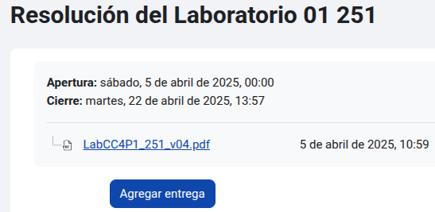
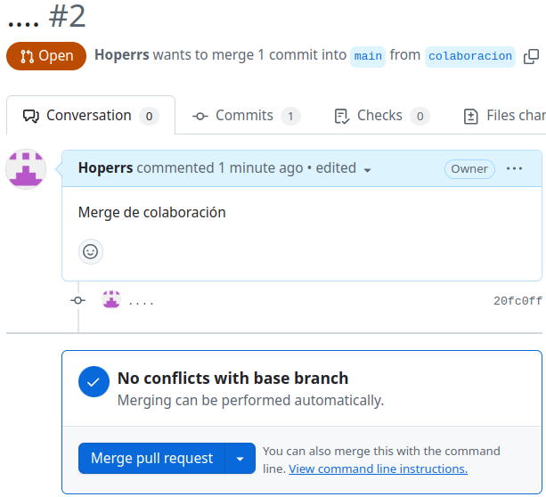
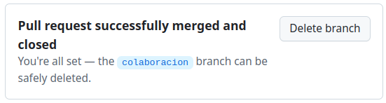

## Actividad: Explorando diferentes formas de fusionar en Git

### Ejemplos

1. #### Fusión Fast-forward (git merge --ff)

    - **Pasos prácticos**:
  
        ```bash
        hoperrs@hoperrs:~/Escritorio/DS/Actividades/Actividad05$ mkdir prueba-fast-forward-merge
        hoperrs@hoperrs:~/Escritorio/DS/Actividades/Actividad05$ cd prueba-fast-forward-merge/
        hoperrs@hoperrs:~/Escritorio/DS/Actividades/Actividad05/prueba-fast-forward-merge$ git init
        Inicializado repositorio Git vacío en /home/hoperrs/Escritorio/DS/Actividades/Actividad05/prueba-fast-forward-merge/.git/
        ```

        ```bash
        hoperrs@hoperrs:~/Escritorio/DS/Actividades/Actividad05/prueba-fast-forward-merge$ echo "# Mi Proyecto" > README.md
        hoperrs@hoperrs:~/Escritorio/DS/Actividades/Actividad05/prueba-fast-forward-merge$ git add README.md 
        hoperrs@hoperrs:~/Escritorio/DS/Actividades/Actividad05/prueba-fast-forward-merge$ git commit -m "Commit inicial en main"
        [main (commit-raíz) 951ffb4] Commit inicial en main
        1 file changed, 1 insertion(+)
        create mode 100644 README.md
        ```

        ```bash
        hoperrs@hoperrs:~/Escritorio/DS/Actividades/Actividad05/prueba-fast-forward-merge$ git checkout -b add-description
        Cambiado a nueva rama 'add-description'
        ```

        ```bash
        hoperrs@hoperrs:~/Escritorio/DS/Actividades/Actividad05/prueba-fast-forward-merge$ echo "Este proyecto es un ejemplo de cómo usar Git." >> README.md
        hoperrs@hoperrs:~/Escritorio/DS/Actividades/Actividad05/prueba-fast-forward-merge$ git add README.md 
        hoperrs@hoperrs:~/Escritorio/DS/Actividades/Actividad05/prueba-fast-forward-merge$ git commit -m "Agregar descripción al README.md"
        [add-description eccd093] Agregar descripción al README.md
        1 file changed, 1 insertion(+)
        ```

    - **Pregunta:** Muestra la estructura de commits resultante.

        ```bash
        hoperrs@hoperrs:~/Escritorio/DS/Actividades/Actividad05/prueba-fast-forward-merge$ git checkout main
        Cambiado a rama 'main'
        hoperrs@hoperrs:~/Escritorio/DS/Actividades/Actividad05/prueba-fast-forward-merge$ git merge add-description 
        Actualizando 951ffb4..eccd093
        Fast-forward
        README.md | 1 +
        1 file changed, 1 insertion(+)
        ```

        ```bash
        hoperrs@hoperrs:~/Escritorio/DS/Actividades/Actividad05/prueba-fast-forward-merge$ git log --graph --oneline
        * eccd093 (HEAD -> main, add-description) Agregar descripción al README.md
        * 951ffb4 Commit inicial en main
        ```

2. #### Fusión No-fast-forward (git merge --no-ff)

    - **Pasos prácticos:**

        ```bash
        hoperrs@hoperrs:~/Escritorio/DS/Actividades/Actividad05$ mkdir prueba-no-fast-forward-merge
        hoperrs@hoperrs:~/Escritorio/DS/Actividades/Actividad05$ cd prueba-no-fast-forward-merge
        hoperrs@hoperrs:~/Escritorio/DS/Actividades/Actividad05/prueba-no-fast-forward-merge$ git init
        Inicializado repositorio Git vacío en /home/hoperrs/Escritorio/DS/Actividades/Actividad05/prueba-no-fast-forward-merge/.git/
        ```

        ```bash
        hoperrs@hoperrs:~/Escritorio/DS/Actividades/Actividad05/prueba-no-fast-forward-merge$ echo "# Mi Proyecto" > README.md
        hoperrs@hoperrs:~/Escritorio/DS/Actividades/Actividad05/prueba-no-fast-forward-merge$ git add README.md 
        hoperrs@hoperrs:~/Escritorio/DS/Actividades/Actividad05/prueba-no-fast-forward-merge$ git commit -m "Commit inicial en main"
        [main (commit-raíz) 99b97c6] Commit inicial en main
        1 file changed, 1 insertion(+)
        create mode 100644 README.md
        ```

        ```bash
        hoperrs@hoperrs:~/Escritorio/DS/Actividades/Actividad05/prueba-no-fast-forward-merge$ git checkout -b add-feature
        Cambiado a nueva rama 'add-feature'
        ```

        ```bash
        hoperrs@hoperrs:~/Escritorio/DS/Actividades/Actividad05/prueba-no-fast-forward-merge$ echo "Implementando una nueva característica..." >> README.md
        hoperrs@hoperrs:~/Escritorio/DS/Actividades/Actividad05/prueba-no-fast-forward-merge$ git add README.md 
        hoperrs@hoperrs:~/Escritorio/DS/Actividades/Actividad05/prueba-no-fast-forward-merge$ git commit -m "Implementar nueva característica"
        [add-feature 49abd5e] Implementar nueva característica
        1 file changed, 1 insertion(+)
        ```

    - **Pregunta:** Muestra el log de commits resultante.

        ```bash
        hoperrs@hoperrs:~/Escritorio/DS/Actividades/Actividad05/prueba-no-fast-forward-merge$ git checkout main 
        Cambiado a rama 'main'
        hoperrs@hoperrs:~/Escritorio/DS/Actividades/Actividad05/prueba-no-fast-forward-merge$ git merge --no-ff add-feature
        Merge made by the 'ort' strategy.
        README.md | 1 +
        1 file changed, 1 insertion(+)
        ```

        ```bash
        hoperrs@hoperrs:~/Escritorio/DS/Actividades/Actividad05/prueba-no-fast-forward-merge$ git log --graph --oneline
        *   0cfae61 (HEAD -> main) Merge branch 'add-feature'
        |\  
        | * 49abd5e (add-feature) Implementar nueva característica
        |/  
        * 99b97c6 Commit inicial en main
        ```

3. #### Fusión squash (git merge --squash)

    - **Pasos prácticos:**

        ```bash
        hoperrs@hoperrs:~/Escritorio/DS/Actividades/Actividad05$ mkdir prueba-squash-merge
        hoperrs@hoperrs:~/Escritorio/DS/Actividades/Actividad05$ cd prueba-squash-merge
        hoperrs@hoperrs:~/Escritorio/DS/Actividades/Actividad05/prueba-squash-merge$ git init
        Inicializado repositorio Git vacío en /home/hoperrs/Escritorio/DS/Actividades/Actividad05/prueba-squash-merge/.git/
        ```

        ```bash
        hoperrs@hoperrs:~/Escritorio/DS/Actividades/Actividad05/prueba-squash-merge$ echo "# Mi Proyecto" > README.md
        hoperrs@hoperrs:~/Escritorio/DS/Actividades/Actividad05/prueba-squash-merge$ git add README.md
        hoperrs@hoperrs:~/Escritorio/DS/Actividades/Actividad05/prueba-squash-merge$ git commit -m "Commit inicial en main"
        [main (commit-raíz) b744380] Commit inicial en main
        1 file changed, 1 insertion(+)
        create mode 100644 README.md
        hoperrs@hoperrs:~/Escritorio/DS/Actividades/Actividad05/prueba-squash-merge$ 
        ```

        ```bash
        hoperrs@hoperrs:~/Escritorio/DS/Actividades/Actividad05/prueba-squash-merge$ git checkout -b add-basic-files
        Cambiado a nueva rama 'add-basic-files'
        ```

        ```bash
        hoperrs@hoperrs:~/Escritorio/DS/Actividades/Actividad05/prueba-squash-merge$ echo "# CÓMO CONTRIBUIR" >> CONTRIBUTING.md
        hoperrs@hoperrs:~/Escritorio/DS/Actividades/Actividad05/prueba-squash-merge$ git add CONTRIBUTING.md
        hoperrs@hoperrs:~/Escritorio/DS/Actividades/Actividad05/prueba-squash-merge$ git commit -m "Agregar CONTRIBUTING.md"
        [add-basic-files e195cc6] Agregar CONTRIBUTING.md
        1 file changed, 1 insertion(+)
        create mode 100644 CONTRIBUTING.md
        ```

        ```bash
        hoperrs@hoperrs:~/Escritorio/DS/Actividades/Actividad05/prueba-squash-merge$ echo "# LICENCIA" >> LICENSE.txt
        hoperrs@hoperrs:~/Escritorio/DS/Actividades/Actividad05/prueba-squash-merge$ git add LICENSE.txt
        hoperrs@hoperrs:~/Escritorio/DS/Actividades/Actividad05/prueba-squash-merge$ git commit -m "Agregar LICENSE.txt"
        [add-basic-files b3f8f19] Agregar LICENSE.txt
        1 file changed, 1 insertion(+)
        create mode 100644 LICENSE.txt
        ```

    - **Pregunta:** ¿Cuál es tu estructura de commits?

        ```bash
        hoperrs@hoperrs:~/Escritorio/DS/Actividades/Actividad05/prueba-squash-merge$ git checkout main
        Cambiado a rama 'main'
        hoperrs@hoperrs:~/Escritorio/DS/Actividades/Actividad05/prueba-squash-merge$ git merge --squash add-basic-files
        Actualizando b744380..b3f8f19
        Fast-forward
        Commit de aplastamiento -- no actualizando HEAD
        CONTRIBUTING.md | 1 +
        LICENSE.txt     | 1 +
        2 files changed, 2 insertions(+)
        create mode 100644 CONTRIBUTING.md
        create mode 100644 LICENSE.txt
        ```

        ```bash
        hoperrs@hoperrs:~/Escritorio/DS/Actividades/Actividad05/prueba-squash-merge$ git add .
        hoperrs@hoperrs:~/Escritorio/DS/Actividades/Actividad05/prueba-squash-merge$ git commit -m "Agregar documentación estándar del repositorio"
        [main 0fd982b] Agregar documentación estándar del repositorio
        2 files changed, 2 insertions(+)
        create mode 100644 CONTRIBUTING.md
        create mode 100644 LICENSE.txt
        hoperrs@hoperrs:~/Escritorio/DS/Actividades/Actividad05/prueba-squash-merge$ git log --graph --oneline
        * 0fd982b (HEAD -> main) Agregar documentación estándar del repositorio
        * b744380 Commit inicial en main
        ```


### Ejercicios

- #### Ejercicio: Resolver conflictos en una fusión non-fast-forward

    **Pasos:**

    ```bash
    hoperrs@hoperrs:~/Escritorio/DS/Actividades/Actividad05$ mkdir prueba-merge-conflict
    hoperrs@hoperrs:~/Escritorio/DS/Actividades/Actividad05$ cd prueba-merge-conflict
    hoperrs@hoperrs:~/Escritorio/DS/Actividades/Actividad05/prueba-merge-conflict$ git init
    Inicializado repositorio Git vacío en /home/hoperrs/Escritorio/DS/Actividades/Actividad05/prueba-merge-conflict/.git/
    ```

    ```bash
    hoperrs@hoperrs:~/Escritorio/DS/Actividades/Actividad05/prueba-merge-conflict$ echo "<html><body><h1>Proyecto inicial CC3S2</h1></body></html>" > index.html
    hoperrs@hoperrs:~/Escritorio/DS/Actividades/Actividad05/prueba-merge-conflict$ git add index.html
    hoperrs@hoperrs:~/Escritorio/DS/Actividades/Actividad05/prueba-merge-conflict$ git commit -m "commit inicial del  index.html en main"
    [main (commit-raíz) c320ab7] commit inicial del  index.html en main
    1 file changed, 1 insertion(+)
    create mode 100644 index.html
    ```

    ```bash
    hoperrs@hoperrs:~/Escritorio/DS/Actividades/Actividad05/prueba-merge-conflict$ git checkout -b feature-update
    Cambiado a nueva rama 'feature-update'
    ```

    ```bash
    hoperrs@hoperrs:~/Escritorio/DS/Actividades/Actividad05/prueba-merge-conflict$ echo "<p>.....</p>" >> index.html
    hoperrs@hoperrs:~/Escritorio/DS/Actividades/Actividad05/prueba-merge-conflict$ git add index.html
    hoperrs@hoperrs:~/Escritorio/DS/Actividades/Actividad05/prueba-merge-conflict$ git commit -m "Actualiza ..."
    [feature-update 482969e] Actualiza ...
    1 file changed, 1 insertion(+)
    ```

    ```bash
    hoperrs@hoperrs:~/Escritorio/DS/Actividades/Actividad05/prueba-merge-conflict$ git checkout main
    Cambiado a rama 'main'
    hoperrs@hoperrs:~/Escritorio/DS/Actividades/Actividad05/prueba-merge-conflict$ echo "<footer>Contacta aquí example@example.com</footer>" >> index.html
    hoperrs@hoperrs:~/Escritorio/DS/Actividades/Actividad05/prueba-merge-conflict$ git add index.html
    hoperrs@hoperrs:~/Escritorio/DS/Actividades/Actividad05/prueba-merge-conflict$ git commit -m "....index.html"
    [main 5d72f0a] ....index.html
    1 file changed, 1 insertion(+)
    ```

    ```bash
    hoperrs@hoperrs:~/Escritorio/DS/Actividades/Actividad05/prueba-merge-conflict$ git merge --no-ff feature-update
    Auto-fusionando index.html
    CONFLICTO (contenido): Conflicto de fusión en index.html
    Fusión automática falló; arregle los conflictos y luego realice un commit con el resultado.
    ```

    ```
    hoperrs@hoperrs:~/Escritorio/DS/Actividades/Actividad05/prueba-merge-conflict$ cat index.html 
    <html><body><h1>Proyecto inicial CC3S2</h1></body></html>
    <<<<<<< HEAD
    <footer>Contacta aquí example@example.com</footer>
    =======
    <p>.....</p>
    >>>>>>> feature-update
    hoperrs@hoperrs:~/Escritorio/DS/Actividades/Actividad05/prueba-merge-conflict$ cat index.html 
    <html><body><h1>Proyecto inicial CC3S2</h1></body></html>
    <footer>Contacta aquí example@example.com</footer>
    <p>.....</p>
    ```

    ```bash
    hoperrs@hoperrs:~/Escritorio/DS/Actividades/Actividad05/prueba-merge-conflict$ git add index.html
    hoperrs@hoperrs:~/Escritorio/DS/Actividades/Actividad05/prueba-merge-conflict$ git commit
    [main 6ca71f1] Merge branch 'feature-update'
    ```

    ```bash
    hoperrs@hoperrs:~/Escritorio/DS/Actividades/Actividad05/prueba-merge-conflict$ git log --graph --oneline
    *   6ca71f1 (HEAD -> main) Merge branch 'feature-update'
    |\  
    | * 482969e (feature-update) Actualiza ...
    * | 5d72f0a ....index.html
    |/  
    * c320ab7 commit inicial del  index.html en main
    ```

    **Preguntas:**

    - <u>¿Qué pasos adicionales tuviste que tomar para resolver el conflicto?</u>

        Tuve que abrir y resolver manualmente el conflicto en el archivo `index.html`, luego agregar los cambios con `git add .`, y finalmente confirmar los cambios con `git commit` para poder finalizar el merge.

    - <u>¿Qué estrategias podrías emplear para evitar conflictos en futuros desarrollos colaborativos?</u>

        Evitar que dos o más colaboradores hagan cambios en un mismo archivo en sus respectivas ramas.

- #### Ejercicio: Comparar los historiales con git log después de diferentes fusiones

    **Pasos:**

    ```bash
    hoperrs@hoperrs:~/Escritorio/DS/Actividades/Actividad05$ mkdir prueba-compare-merge
    hoperrs@hoperrs:~/Escritorio/DS/Actividades/Actividad05$ cd prueba-compare-merge
    hoperrs@hoperrs:~/Escritorio/DS/Actividades/Actividad05/prueba-compare-merge$ git init
    Inicializado repositorio Git vacío en /home/hoperrs/Escritorio/DS/Actividades/Actividad05/prueba-compare-merge/.git/
    hoperrs@hoperrs:~/Escritorio/DS/Actividades/Actividad05/prueba-compare-merge$ echo "Version 1.0" > version.txt
    hoperrs@hoperrs:~/Escritorio/DS/Actividades/Actividad05/prueba-compare-merge$ git add version.txt
    hoperrs@hoperrs:~/Escritorio/DS/Actividades/Actividad05/prueba-compare-merge$ git commit -m "...."
    [main (commit-raíz) df527d8] ....
    1 file changed, 1 insertion(+)
    create mode 100644 version.txt
    hoperrs@hoperrs:~/Escritorio/DS/Actividades/Actividad05/prueba-compare-merge$ git checkout -b feature-1
    Cambiado a nueva rama 'feature-1'
    hoperrs@hoperrs:~/Escritorio/DS/Actividades/Actividad05/prueba-compare-merge$ echo "Caracteristica 1 agregada" >> version.txt
    hoperrs@hoperrs:~/Escritorio/DS/Actividades/Actividad05/prueba-compare-merge$ git add version.txt
    hoperrs@hoperrs:~/Escritorio/DS/Actividades/Actividad05/prueba-compare-merge$ git commit -m "Agregar caracteristica 1"
    [feature-1 dc2bf5f] Agregar caracteristica 1
    1 file changed, 1 insertion(+)
    hoperrs@hoperrs:~/Escritorio/DS/Actividades/Actividad05/prueba-compare-merge$ git checkout main
    Cambiado a rama 'main'
    hoperrs@hoperrs:~/Escritorio/DS/Actividades/Actividad05/prueba-compare-merge$ git checkout -b feature-2
    Cambiado a nueva rama 'feature-2'
    hoperrs@hoperrs:~/Escritorio/DS/Actividades/Actividad05/prueba-compare-merge$ echo "Caracteristica 2 agregada" >> version.txt
    hoperrs@hoperrs:~/Escritorio/DS/Actividades/Actividad05/prueba-compare-merge$ git add version.txt
    hoperrs@hoperrs:~/Escritorio/DS/Actividades/Actividad05/prueba-compare-merge$ git commit -m "Se agrega caracteristica 2"
    [feature-2 f8c7aec] Se agrega caracteristica 2
    1 file changed, 1 insertion(+)
    ```

    ```bash
    hoperrs@hoperrs:~/Escritorio/DS/Actividades/Actividad05/prueba-compare-merge$ git checkout main 
    Cambiado a rama 'main'
    hoperrs@hoperrs:~/Escritorio/DS/Actividades/Actividad05/prueba-compare-merge$ git merge feature-1 --ff
    Actualizando df527d8..dc2bf5f
    Fast-forward
    version.txt | 1 +
    1 file changed, 1 insertion(+)
    ```

    ```bash
    hoperrs@hoperrs:~/Escritorio/DS/Actividades/Actividad05/prueba-compare-merge$ git merge feature-2 --no-ff
    Auto-fusionando version.txt
    CONFLICTO (contenido): Conflicto de fusión en version.txt
    Fusión automática falló; arregle los conflictos y luego realice un commit con el resultado.
    hoperrs@hoperrs:~/Escritorio/DS/Actividades/Actividad05/prueba-compare-merge$ git add version.txt 
    hoperrs@hoperrs:~/Escritorio/DS/Actividades/Actividad05/prueba-compare-merge$ git commit
    [main d6e3336] Merge branch 'feature-2'
    ```

    ```bash
    hoperrs@hoperrs:~/Escritorio/DS/Actividades/Actividad05/prueba-compare-merge$ git checkout -b feature-3
    Cambiado a nueva rama 'feature-3'
    hoperrs@hoperrs:~/Escritorio/DS/Actividades/Actividad05/prueba-compare-merge$ echo "Caracteristica 3 paso 1" >> version.txt
    hoperrs@hoperrs:~/Escritorio/DS/Actividades/Actividad05/prueba-compare-merge$ git add version.txt
    hoperrs@hoperrs:~/Escritorio/DS/Actividades/Actividad05/prueba-compare-merge$ git commit -m "Caracteristica 3 paso 1"
    [feature-3 f22b5d1] Caracteristica 3 paso 1
    1 file changed, 1 insertion(+)
    hoperrs@hoperrs:~/Escritorio/DS/Actividades/Actividad05/prueba-compare-merge$ echo "Caracteristica 3 paso 2" >> version.txt
    hoperrs@hoperrs:~/Escritorio/DS/Actividades/Actividad05/prueba-compare-merge$ git add version.txt
    hoperrs@hoperrs:~/Escritorio/DS/Actividades/Actividad05/prueba-compare-merge$ git commit -m "Caracteristica 3 paso 2"
    [feature-3 def3dcd] Caracteristica 3 paso 2
    1 file changed, 1 insertion(+)
    hoperrs@hoperrs:~/Escritorio/DS/Actividades/Actividad05/prueba-compare-merge$ git checkout main
    Cambiado a rama 'main'
    hoperrs@hoperrs:~/Escritorio/DS/Actividades/Actividad05/prueba-compare-merge$ git merge --squash feature-3
    Actualizando d6e3336..def3dcd
    Fast-forward
    Commit de aplastamiento -- no actualizando HEAD
    version.txt | 2 ++
    1 file changed, 2 insertions(+)
    hoperrs@hoperrs:~/Escritorio/DS/Actividades/Actividad05/prueba-compare-merge$ git commit -m "Agregar caracteristica 3 en un commit"
    [main 6e43910] Agregar caracteristica 3 en un commit
    1 file changed, 2 insertions(+)
    ```

    **Preguntas:**

    - <u>¿Cómo se ve el historial en cada tipo de fusión?</u>

        Fast-forward:

        ```bash
        hoperrs@hoperrs:~/Escritorio/DS/Actividades/Actividad05/prueba-compare-merge$ git log --oneline --graph
        * dc2bf5f (HEAD -> main, feature-1) Agregar caracteristica 1
        * df527d8 ....
        ```

        Non-fast-forward:

        ```
        hoperrs@hoperrs:~/Escritorio/DS/Actividades/Actividad05/prueba-compare-merge$ git log --oneline --graph
        *   d6e3336 (HEAD -> main) Merge branch 'feature-2'
        |\  
        | * f8c7aec (feature-2) Se agrega caracteristica 2
        * | dc2bf5f (feature-1) Agregar caracteristica 1
        |/  
        * df527d8 ....
        ```

        Squash:

        ```
        hoperrs@hoperrs:~/Escritorio/DS/Actividades/Actividad05/prueba-compare-merge$ git log --oneline --graph
        * 6e43910 (HEAD -> main) Agregar caracteristica 3 en un commit
        *   d6e3336 Merge branch 'feature-2'
        |\  
        | * f8c7aec (feature-2) Se agrega caracteristica 2
        * | dc2bf5f (feature-1) Agregar caracteristica 1
        |/  
        * df527d8 ....
        ```

    - <u>¿Qué método prefieres en diferentes escenarios y por qué?</u>

        Cuando estoy trabajando solo prefiero usar `Fast-forward`. Cuando estoy trabajando en equipo y queremos guardar el historial de los merge usamos `Non-fast-forward`. Y finalmente cuando estoy trabajando en equipo, queremos tener un historial limpio sin importar mucho la autorio de los commits pasados, usamos `Squash`.


- #### Ejercicio: Usando fusiones automáticas y revertir fusiones

    **Pasos:**

    ```bash
    hoperrs@hoperrs:~/Escritorio/DS/Actividades/Actividad05$ mkdir prueba-auto-merge
    hoperrs@hoperrs:~/Escritorio/DS/Actividades/Actividad05$ cd prueba-auto-merge
    hoperrs@hoperrs:~/Escritorio/DS/Actividades/Actividad05/prueba-auto-merge$ git init
    Inicializado repositorio Git vacío en /home/hoperrs/Escritorio/DS/Actividades/Actividad05/prueba-auto-merge/.git/
    hoperrs@hoperrs:~/Escritorio/DS/Actividades/Actividad05/prueba-auto-merge$ echo "Linea 1" > file.txt
    hoperrs@hoperrs:~/Escritorio/DS/Actividades/Actividad05/prueba-auto-merge$ git add file.txt
    hoperrs@hoperrs:~/Escritorio/DS/Actividades/Actividad05/prueba-auto-merge$ git commit -m "Agrega linea 1"
    [main (commit-raíz) 2799566] Agrega linea 1
    1 file changed, 1 insertion(+)
    create mode 100644 file.txt
    hoperrs@hoperrs:~/Escritorio/DS/Actividades/Actividad05/prueba-auto-merge$ echo "Linea 2" >> file.txt
    hoperrs@hoperrs:~/Escritorio/DS/Actividades/Actividad05/prueba-auto-merge$ git add file.txt
    hoperrs@hoperrs:~/Escritorio/DS/Actividades/Actividad05/prueba-auto-merge$ git commit -m "...linea 2"
    [main 83f59ad] ...linea 2
    1 file changed, 1 insertion(+)
    ```

    ```bash
    hoperrs@hoperrs:~/Escritorio/DS/Actividades/Actividad05/prueba-auto-merge$ git checkout -b auto-merge
    Cambiado a nueva rama 'auto-merge'
    hoperrs@hoperrs:~/Escritorio/DS/Actividades/Actividad05/prueba-auto-merge$ echo "Linea 3" >> file2.txt
    hoperrs@hoperrs:~/Escritorio/DS/Actividades/Actividad05/prueba-auto-merge$ git add file2.txt 
    hoperrs@hoperrs:~/Escritorio/DS/Actividades/Actividad05/prueba-auto-merge$ git commit -m "... linea 3"
    [auto-merge 4f257df] ... linea 3
    1 file changed, 1 insertion(+)
    create mode 100644 file2.txt
    ```

    ```bash
    hoperrs@hoperrs:~/Escritorio/DS/Actividades/Actividad05/prueba-auto-merge$ git checkout main
    Cambiado a rama 'main'
    hoperrs@hoperrs:~/Escritorio/DS/Actividades/Actividad05/prueba-auto-merge$ echo "Footer: Fin del archivo" >> file.txt
    hoperrs@hoperrs:~/Escritorio/DS/Actividades/Actividad05/prueba-auto-merge$ git add file.txt
    hoperrs@hoperrs:~/Escritorio/DS/Actividades/Actividad05/prueba-auto-merge$ git commit -m "Add footer al archivo file.txt"
    [main e925631] Add footer al archivo file.txt
    1 file changed, 1 insertion(+)
    ```

    ```bash
    hoperrs@hoperrs:~/Escritorio/DS/Actividades/Actividad05/prueba-auto-merge$ git merge auto-merge
    Merge made by the 'ort' strategy.
    file2.txt | 1 +
    1 file changed, 1 insertion(+)
    create mode 100644 file2.txt
    ```

    ```bash
    hoperrs@hoperrs:~/Escritorio/DS/Actividades/Actividad05/prueba-auto-merge$ git revert -m 1 HEAD
    [main 8045516] Revert "Merge branch 'auto-merge'"
    1 file changed, 1 deletion(-)
    delete mode 100644 file2.txt
    ```

    ```bash
    hoperrs@hoperrs:~/Escritorio/DS/Actividades/Actividad05/prueba-auto-merge$ git log --graph --oneline
    * 8045516 (HEAD -> main) Revert "Merge branch 'auto-merge'"
    *   2b6341c Merge branch 'auto-merge'
    |\  
    | ***** 4f257df (auto-merge) ... linea 3
    * | e925631 Add footer al archivo file.txt
    |/  
    * 83f59ad ...linea 2
    * 2799566 Agrega linea 1
    ```

    **Preguntas:**

    - <u>¿Cuándo usarías un comando como git revert para deshacer una fusión?</u>

        Cuando necesito deshacer la fusión pero quiero mantener un historial limpio. También es útil si el commit de fusión ya ha sido compartido en un repositorio remoto, `git revert` es más seguro porque no altera el historial compartido y mantiene su integridad.

    - <u>¿Qué tan útil es la función de fusión automática en Git?</u>

        Es útil solo cuando se quiere unir commits que no tengan conflictos, se quiere generar un commit unión, y se sabe el comportamiento que tomará.


- #### Ejercicio: Fusión remota en un repositorio colaborativo

    **Pasos:**

    ```bash
    hoperrs@hoperrs:~/Escritorio$ git clone git@github.com:Hoperrs/DesarrolloSoftware_25-1.git
    Clonando en 'DesarrolloSoftware_25-1'...
    remote: Enumerating objects: 47, done.
    remote: Counting objects: 100% (47/47), done.
    remote: Compressing objects: 100% (27/27), done.
    remote: Total 47 (delta 12), reused 43 (delta 9), pack-reused 0 (from 0)
    Recibiendo objetos: 100% (47/47), 244.63 KiB | 1.04 MiB/s, listo.
    Resolviendo deltas: 100% (12/12), listo.
    hoperrs@hoperrs:~/Escritorio$ cd DesarrolloSoftware_25-1/
    ```

    ```bash
    hoperrs@hoperrs:~/Escritorio/DesarrolloSoftware_25-1$ git checkout -b colaboracion
    Cambiado a nueva rama 'colaboracion'
    hoperrs@hoperrs:~/Escritorio/DesarrolloSoftware_25-1$ echo "Colaboración remota" > colaboracion.txt
    hoperrs@hoperrs:~/Escritorio/DesarrolloSoftware_25-1$ git add colaboracion.txt 
    hoperrs@hoperrs:~/Escritorio/DesarrolloSoftware_25-1$ git commit -m "...."
    [colaboracion 20fc0ff] ....
    1 file changed, 1 insertion(+)
    create mode 100644 colaboracion.txt
    ```

    ```bash
    hoperrs@hoperrs:~/Escritorio/DesarrolloSoftware_25-1$ git push origin colaboracion 
    Enumerando objetos: 4, listo.
    Contando objetos: 100% (4/4), listo.
    Compresión delta usando hasta 12 hilos
    Comprimiendo objetos: 100% (2/2), listo.
    Escribiendo objetos: 100% (3/3), 301 bytes | 301.00 KiB/s, listo.
    Total 3 (delta 0), reused 0 (delta 0), pack-reused 0 (from 0)
    remote: 
    remote: Create a pull request for 'colaboracion' on GitHub by visiting:
    remote:      https://github.com/Hoperrs/DesarrolloSoftware_25-1/pull/new/colaboracion
    remote: 
    To github.com:Hoperrs/DesarrolloSoftware_25-1.git
    * [new branch]      colaboracion -> colaboracion
    ```

    <div style="text-align:center">
        
    </div>

    <div style="text-align:center">
        
    </div>

    <div style="text-align:center">
        
    </div>

    <div style="text-align:center">
        
    </div>

    **Preguntas:**

    - <u>¿Cómo cambia la estrategia de fusión cuando colaboras con otras personas en un repositorio remoto?</u>

        Cuando se colabora con otras personas, una muy buena opción es que cada uno trabaje en su propia rama y haga un PR para que el equipo revise y apruebe sus cambios, y se elija la mejor opción de tipo de merge a usar.
    
    - <u>¿Qué problemas comunes pueden surgir al integrar ramas remotas?</u>

        Que se realicen cambios en los mismo archivos y esto genere conflictos, y/o que la rama en la que se trabaje no tengo los últimos cambios.
    
- #### Ejercicio final: flujo de trabajo completo

    ```bash
    hoperrs@hoperrs:~/Escritorio/DS/Actividades/Actividad05$ mkdir ejercicio-final
    hoperrs@hoperrs:~/Escritorio/DS/Actividades/Actividad05$ cd ejercicio-final/
    hoperrs@hoperrs:~/Escritorio/DS/Actividades/Actividad05/ejercicio-final$ git init
    Inicializado repositorio Git vacío en /home/hoperrs/Escritorio/DS/Actividades/Actividad05/ejercicio-final/.git/
    ```

    ```bash
    hoperrs@hoperrs:~/Escritorio/DS/Actividades/Actividad05/ejercicio-final$ echo "#main.py" > main.py
    hoperrs@hoperrs:~/Escritorio/DS/Actividades/Actividad05/ejercicio-final$ git add main.py 
    hoperrs@hoperrs:~/Escritorio/DS/Actividades/Actividad05/ejercicio-final$ git commit -m "...."
    [main (commit-raíz) dee987b] ....
    1 file changed, 1 insertion(+)
    create mode 100644 main.py
    ```

    ```bash
    hoperrs@hoperrs:~/Escritorio/DS/Actividades/Actividad05/ejercicio-final$ git checkout -b feature1
    Cambiado a nueva rama 'feature1'
    hoperrs@hoperrs:~/Escritorio/DS/Actividades/Actividad05/ejercicio-final$ echo "#app1.py" > app1.py
    hoperrs@hoperrs:~/Escritorio/DS/Actividades/Actividad05/ejercicio-final$ git add app1.py 
    hoperrs@hoperrs:~/Escritorio/DS/Actividades/Actividad05/ejercicio-final$ git commit -m "Agregar funcionalidad-1"
    [feature1 927458f] Agregar funcionalidad-1
    1 file changed, 1 insertion(+)
    create mode 100644 app1.py
    ```

    ```bash
    hoperrs@hoperrs:~/Escritorio/DS/Actividades/Actividad05/ejercicio-final$ git checkout main
    Cambiado a rama 'main'
    hoperrs@hoperrs:~/Escritorio/DS/Actividades/Actividad05/ejercicio-final$ git checkout -b feature2
    Cambiado a nueva rama 'feature2'
    hoperrs@hoperrs:~/Escritorio/DS/Actividades/Actividad05/ejercicio-final$ echo "#app2.py" > app2.py
    hoperrs@hoperrs:~/Escritorio/DS/Actividades/Actividad05/ejercicio-final$ git add app2.py 
    hoperrs@hoperrs:~/Escritorio/DS/Actividades/Actividad05/ejercicio-final$ git commit -m "Agregar funcionalidad-2"
    [feature2 f2176a6] Agregar funcionalidad-2
    1 file changed, 1 insertion(+)
    create mode 100644 app2.py
    ```

    ```bash
    hoperrs@hoperrs:~/Escritorio/DS/Actividades/Actividad05/ejercicio-final$ git checkout main
    Cambiado a rama 'main'
    hoperrs@hoperrs:~/Escritorio/DS/Actividades/Actividad05/ejercicio-final$ git merge feature1 --ff
    Actualizando dee987b..927458f
    Fast-forward
    app1.py | 1 +
    1 file changed, 1 insertion(+)
    create mode 100644 app1.py
    ```

    ```bash
    hoperrs@hoperrs:~/Escritorio/DS/Actividades/Actividad05/ejercicio-final$ git merge feature2 --no-ff
    Merge made by the 'ort' strategy.
    app2.py | 1 +
    1 file changed, 1 insertion(+)
    create mode 100644 app2.py
    ```

    ```bash
    hoperrs@hoperrs:~/Escritorio/DS/Actividades/Actividad05/ejercicio-final$ git checkout -b feature3
    Cambiado a nueva rama 'feature3'
    hoperrs@hoperrs:~/Escritorio/DS/Actividades/Actividad05/ejercicio-final$ echo "#app3.py" > app3.py
    hoperrs@hoperrs:~/Escritorio/DS/Actividades/Actividad05/ejercicio-final$ git add app3.py 
    hoperrs@hoperrs:~/Escritorio/DS/Actividades/Actividad05/ejercicio-final$ git commit -m "Agregar funcionalidad-3"
    [feature3 d1f8d2b] Agregar funcionalidad-3
    1 file changed, 1 insertion(+)
    create mode 100644 app3.py
    hoperrs@hoperrs:~/Escritorio/DS/Actividades/Actividad05/ejercicio-final$ echo "#funcionalidad 3.1" > app3.py
    hoperrs@hoperrs:~/Escritorio/DS/Actividades/Actividad05/ejercicio-final$ git add app3.py 
    hoperrs@hoperrs:~/Escritorio/DS/Actividades/Actividad05/ejercicio-final$ git commit -m "Funcionalidad 3.1"
    [feature3 dcd426e] Funcionalidad 3.1
    1 file changed, 1 insertion(+), 1 deletion(-)
    hoperrs@hoperrs:~/Escritorio/DS/Actividades/Actividad05/ejercicio-final$ echo "#funcionalidad 3.2" > app3.py 
    hoperrs@hoperrs:~/Escritorio/DS/Actividades/Actividad05/ejercicio-final$ git add app3.py 
    hoperrs@hoperrs:~/Escritorio/DS/Actividades/Actividad05/ejercicio-final$ git commit -m "Funcionalidad 3.2"
    [feature3 585a35d] Funcionalidad 3.2
    1 file changed, 1 insertion(+), 1 deletion(-)
    hoperrs@hoperrs:~/Escritorio/DS/Actividades/Actividad05/ejercicio-final$ git checkout main 
    Cambiado a rama 'main'
    hoperrs@hoperrs:~/Escritorio/DS/Actividades/Actividad05/ejercicio-final$ git merge --squash feature3
    Actualizando 0379109..585a35d
    Fast-forward
    Commit de aplastamiento -- no actualizando HEAD
    app3.py | 1 +
    1 file changed, 1 insertion(+)
    create mode 100644 app3.py
    hoperrs@hoperrs:~/Escritorio/DS/Actividades/Actividad05/ejercicio-final$ git commit -m "Agregar funcionalidad-3 completa"
    [main 1c7d765] Agregar funcionalidad-3 completa
    1 file changed, 1 insertion(+)
    create mode 100644 app3.py
    ```

    ```bash
    hoperrs@hoperrs:~/Escritorio/DS/Actividades/Actividad05/ejercicio-final$ git log --oneline --graph
    * 1c7d765 (HEAD -> main) Agregar funcionalidad-3 completa
    *   0379109 Merge branch 'feature2'
    |\  
    | * f2176a6 (feature2) Agregar funcionalidad-2
    * | 927458f (feature1) Agregar funcionalidad-1
    |/  
    * dee987b ....
    ```

---